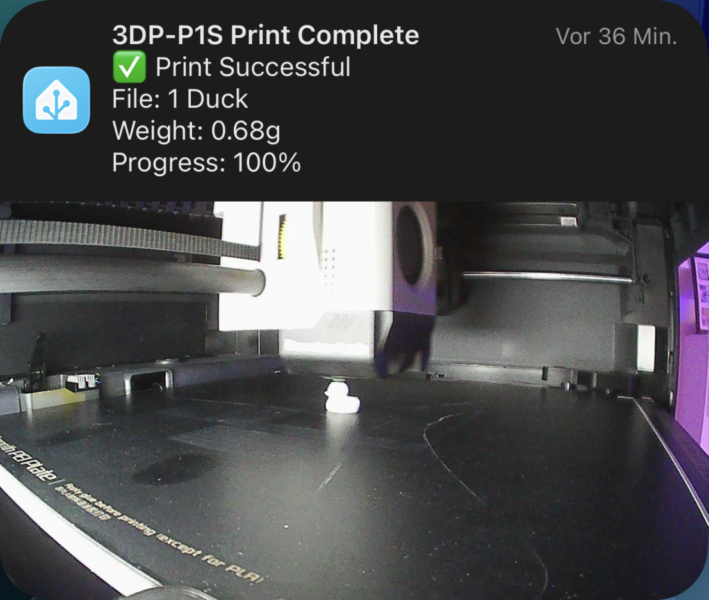

# Bambu Printer Notification Blueprint — Fork

[](https://www.home-assistant.io/)
[](LICENSE)

[](https://my.home-assistant.io/redirect/blueprint_import/?blueprint_url=https%3A%2F%2Fraw.githubusercontent.com%2Fdabo53ck%2Fbambu-print-notify-blueprint%2Frefs%2Fheads%2Fmain%2Fblueprints%2Fautomation%2Fdabo53ck%2Fbambu_print_notify.yaml)

A Home Assistant blueprint that sends a mobile notification with a camera snapshot when your Bambu printer finishes or faults.

This is a fork of [HallyAus/homeassistant-bambu-blueprints](https://github.com/HallyAus/homeassistant-bambu-blueprints), reworked around one central finding: **progress percentage is the wrong trigger for the snapshot.** See [Why this fork exists](#why-this-fork-exists).



> **Not upstream-compatible.** Several inputs were removed. If you are migrating from the original blueprint, read [Migrating from upstream](#migrating-from-upstream) first.

---

## Why this fork exists

The original blueprint takes its snapshot when print progress crosses a configurable threshold (default 99%). On a Bambu P1S that does not work reliably, for two measured reasons:

**1. Progress skips values.** Recorded sensor history from a real print:

| Time | Sensor | Value |
| ---- | ------ | ----- |
| 19:47:54.282 | current stage | `printing` → `idle` |
| 19:47:54.289 | progress | 96 → **97 %** |
| 19:48:35.750 | progress | 97 → **100 %** |
| 19:48:35.759 | print status | `running` → `finish` |

Progress jumped straight from 97 % to 100 %. A threshold of 98 % or 99 % was never crossed as a distinct value — it only fired on the jump to 100 %, at which point the print was already over.

**2. The plate is already moving by then.** Between the stage change (19:47:54) and the progress/status update (19:48:35) lies a **41-second window** in which the P1S lowers the build plate. A snapshot taken at the later timestamp shows a plate on its way down, not the finished print.

The stage sensor leaves `printing` at the *start* of that window and is a discrete state change that cannot be skipped. This fork triggers on that instead.

Setting the threshold to 100 % appears to fix things in the original, but only by accident: `numeric_state` with `above: 100` can never fire, so the progress trigger is silently dead and the notification arrives via the `finish` backup trigger instead.

---

## Changes from upstream

### Trigger logic

- **New primary trigger** — fires when the stage sensor leaves `printing`, `inspecting_first_layer` or `auto_bed_leveling`. Guarded with `not_to: [unavailable, unknown]` so an MQTT dropout mid-print is not mistaken for the end of a print.
- **Progress trigger demoted to a fallback**, hardcoded to `above: 99`. It only matters if the stage sensor is unavailable or another printer model behaves differently. The configurable threshold input is gone.
- **`startup` / `automation_reloaded` triggers removed.** They fired, evaluated every condition, and were then immediately cancelled by the first action. Pure overhead — and they consumed the limited automation trace slots, which makes debugging harder.

### Correctness fixes

- **`wait_for_trigger` guard reworked** (upstream [issue #7](https://github.com/HallyAus/homeassistant-bambu-blueprints/issues/7)). The step is now entered only while print status is still `running`. Upstream, and also [PR #8](https://github.com/HallyAus/homeassistant-bambu-blueprints/pull/8), check for `finish`/`failed` instead — but `finish` is often a short-lived intermediate state that has already passed to `idle` by the time the check runs, so the automation waited out the full 10-minute timeout.
- **`mode: single` instead of `queued`.** All triggers point at the same snapshot filename and the same notification tag. Under `queued`, the late triggers overwrote the correctly-timed snapshot roughly 400 ms after the notification was sent, and replaced the notification on the phone. They are now discarded while a run is in flight (`max_exceeded: silent`).
- **Values re-read after the wait.** `progress`, `status` and `print_weight` are read fresh once the print has actually ended. Otherwise the notification reported the value from trigger time — with the earlier stage trigger that would read `97 %` instead of `100 %`.
- **Notification body no longer indented.** The old block scalar carried its YAML indentation into the message, so every line after the first was prefixed with two spaces on the phone.
- **Critical time window semantics corrected.** Identical start and end time now means *never critical*, which is what the upstream v2 release notes describe. The code did the opposite (all-day critical). Success window defaults changed from `00:00–00:00` to `07:00–21:00` to match the fault block.

### Removals

- **TTS announcements removed entirely.** The `tts.speak` branch could not work — it passed the *service name* as the target entity, where `tts.speak` requires an actual TTS entity. Failures were swallowed by `continue_on_error: true`. Removing it also drops eight `strptime` calls that ran on every single trigger for the quiet-hours check, even with TTS disabled. Use the custom success/fault actions if you want announcements.
- **Cooldown condition and input removed.** It never blocked anything in practice, and `mode: single` covers the burst case it was meant to handle.
- **Unused top-level variables removed** (`status`, `print_weight` — both recomputed after the wait anyway).
- **`paused` dropped from the stage guard list** — the Bambu stage sensor reports `paused_nozzle_clog`, `paused_user` and similar, never a bare `paused`.

### Diagnostics

- `trace: stored_traces: 20` — the default of 5 was routinely exhausted by a single print's triggers.

---

## Requirements

- Home Assistant **2024.6.0** or newer
- [Bambu Lab integration](https://github.com/greghesp/ha-bambulab)
- A camera entity for your printer
- A snapshot folder under `/config/www/` — see [Configuration](#configuration), this is the first thing to set up
- Mobile app for push notifications (optional)

---

## Installation

### One-click import

[](https://my.home-assistant.io/redirect/blueprint_import/?blueprint_url=https%3A%2F%2Fraw.githubusercontent.com%2Fdabo53ck%2Fbambu-print-notify-blueprint%2Frefs%2Fheads%2Fmain%2Fblueprints%2Fautomation%2Fdabo53ck%2Fbambu_print_notify.yaml)

Requires the [My Home Assistant](https://my.home-assistant.io/) redirect service,
which is enabled by default. The link opens the import dialog in your own
instance with the blueprint URL pre-filled — confirm with **Preview** → **Import**.

### Import via URL

If the button does not work (My Home Assistant disabled, or a non-standard
setup), import manually:

1. **Settings → Automations & Scenes → Blueprints → Import Blueprint**
2. Paste this URL:
   `https://raw.githubusercontent.com/dabo53ck/bambu-print-notify-blueprint/refs/heads/main/blueprints/automation/dabo53ck/bambu_print_notify.yaml`
3. **Preview** → **Import**

### Manual

1. Copy `blueprints/automation/dabo53ck/bambu_print_notify.yaml` to
   `/config/blueprints/automation/<folder>/bambu_print_notify.yaml`
2. **Settings → Automations & Scenes → Blueprints → Reload**

---

## Configuration

### 0. Snapshot folder (do this first)

The blueprint writes the snapshot to a fixed path and links to it from a
fixed URL:

```
File written by camera.snapshot:  /config/www/snapshots/bambu_<printer_name>.jpg
URL used in the notification:     /local/snapshots/bambu_<printer_name>.jpg
```

`<printer_name>` comes from your printer name sensor, lowercased with spaces
replaced by underscores — e.g. `3DP-P1S` becomes `bambu_3dp-p1s.jpg`. Home
Assistant serves everything under `/config/www/` at the public path `/local/`,
which is why the two paths above differ but point at the same file.

**Home Assistant does not create this folder for you.** If it is missing, the
`camera.snapshot` action fails silently — the blueprint runs it with
`continue_on_error: true` so a missing folder does not stop the automation,
it just means the notification arrives with a broken image link instead of a
photo. There is no error in the log to point you at the cause, which makes
this easy to misdiagnose later — better to create it now.

Create the folder once, before doing anything else below:

- **File editor / Studio Code Server add-on:** navigate to `/config/www/`,
  create a new folder named `snapshots`.
- **Samba / SMB share:** connect to `\\<your-ha-ip>\config\www\`
  from Windows, create a `snapshots` folder there.
- **SSH / Terminal add-on:**
  ```bash
  mkdir -p /config/www/snapshots
  ```

No further permissions setup is needed — Home Assistant already has full
access to everything under `/config/`.

### Printer sensors (required)

| Input | Bambu Lab entity |
| ----- | ---------------- |
| Print status sensor | states `running`, `finish`, `failed` |
| Print error binary sensor | turns ON on error |
| **Current stage sensor** | **drives the primary trigger — must be mapped** |
| Progress sensor | print progress in % |
| Printer name sensor | used for filename and notification tag |
| Task name sensor | current job name |
| Print weight sensor | weight in grams |
| Camera | your printer's camera |
| Notifications enabled | `input_boolean` acting as a master switch |

### Snapshot settings

| Input | Default | Description |
| ----- | ------- | ----------- |
| Snapshot light | *none* | Light switched on before capture, restored afterwards |
| Light brightness | 100 % | Brightness used for the capture |
| Snapshot delay | 1 s | Delay for light warmup / camera exposure. **Every second here eats into the plate-lowering window** — keep it at 0–1 s on a P1S |

### Notification settings

| Input | Default | Description |
| ----- | ------- | ----------- |
| Notify device | *empty* | Your `mobile_app_*` service name, without the `notify.` prefix |
| Success type | Normal | Normal / Critical / Never critical |
| Fault type | Critical | Normal / Critical / Never critical |
| Success window | 07:00–21:00 | Only when type is Critical |
| Fault window | 07:00–21:00 | Only when type is Critical |
| Critical sound | default | iOS sound name |
| Critical volume | 1.0 | 0.0–1.0 |

Identical start and end time = **never critical**. For critical around the clock use `00:00:00`–`23:59:59`.

### Custom actions

Any Home Assistant actions, run on success or on fault — indicator lights, smart plugs, scripts, extra notification services, pausing other printers.

---

## Migrating from upstream

The following inputs no longer exist. Home Assistant may refuse to load an automation that still references them.

- `progress_trigger_threshold`
- `cooldown_minutes`
- `tts_enable`, `tts_service`, `tts_media_player`, `tts_volume`,
  `tts_success_message`, `tts_fault_message`,
  `tts_quiet_hours_enable`, `tts_quiet_hours_start`, `tts_quiet_hours_end`

Open the automation, choose **⋮ → Edit in YAML**, and delete those lines from the `input:` block.

Also make sure **Current stage sensor** is mapped — it was optional in practice before, and is now the primary trigger.

---

## Troubleshooting

**Snapshot still shows the plate lowering.**
Check the trace: **Automation → ⋮ → Traces**. The triggering entity should be your *stage* sensor, and the `camera.snapshot` step should be within a few dozen milliseconds of the trigger timestamp. If the trigger is the progress sensor instead, your stage sensor is probably not mapped or was unavailable.

**Notification arrives minutes late.**
Look for a `wait_for_trigger` step that ran to its 10-minute timeout. That means print status never reached `finish`/`failed` while the automation was waiting.

**Two notifications per print.**
Should not happen under `mode: single`. If it does, check whether the second run shows `execution: failed_single` — that is the expected, discarded run, not a second notification.

**Snapshots not saving.**
See [Snapshot folder](#0-snapshot-folder-do-this-first) above — `/config/www/snapshots/` must exist. `camera.snapshot` runs with `continue_on_error: true`, so a missing directory produces a notification with a broken image link rather than a visible error in the log.

---

## Credits

Original blueprint by [@HallyAus](https://github.com/HallyAus) — [upstream repository](https://github.com/HallyAus/homeassistant-bambu-blueprints). Released under CC0, so attribution is not legally required; it is given here because the work deserves it. If you find it useful, [buy them a coffee](https://buymeacoffee.com/hallyaus).

The `wait_for_trigger` timeout problem was independently addressed upstream in [PR #8](https://github.com/HallyAus/homeassistant-bambu-blueprints/pull/8) by [@frederikkuehn](https://github.com/frederikkuehn); this fork uses a different guard condition for the reasons described above.

---

## License

MIT — see [LICENSE](LICENSE).

Upstream is released under [CC0 1.0 Universal](https://creativecommons.org/publicdomain/zero/1.0/), a public domain dedication. CC0 permits relicensing, so this fork is distributed under MIT. Note that the upstream README displays an MIT badge while its `LICENSE` file contains CC0 — the `LICENSE` file is the operative one.
